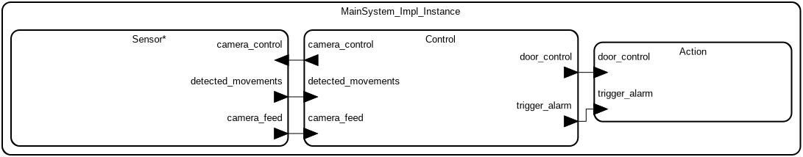
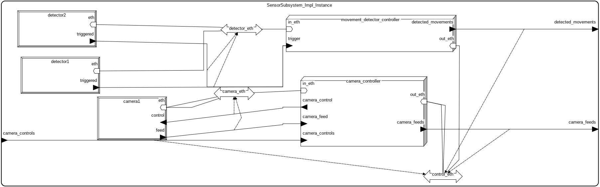
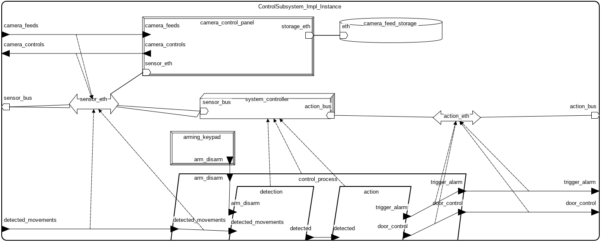
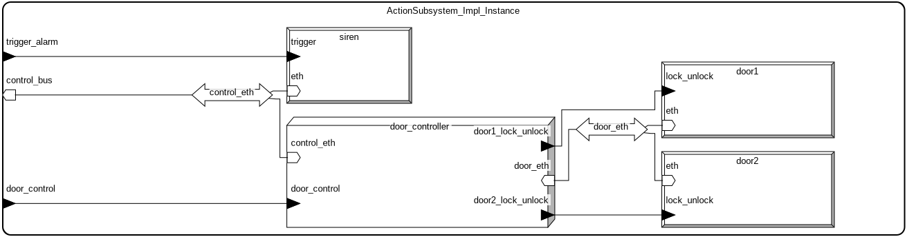

# System Alarmowy
### Michał Tomaszewski mtomaszewski@student.agh.edu.pl

# Opis systemu
System modeluje działanie systemu alarmowego w budynku firmy. Pozwala on na ręczne uzbrajanie i rozbrajanie alarmu, automatyczne uruchamianie procedury alarmowej poprzez rózne urządzenia oraz wykonanie odpowiednich czynności (np. syrena alarmowa, wezwanie ochrony).

# Komponenty systemu alarmowego

### 1. ControlSubsystem

- **ArmingKeypad** – urządzenie do uzbrajania/rozbrajania alarmu.
- **CameraFeedStorage** – pamięć na nagrania z kamer.
- **CameraControlPanel** – panel sterowania kamerą (odbiera obraz, wysyła polecenia sterujące).
- **ControlProcess** – proces obsługujący logikę detekcji i akcji (DetectionThread, ActionThread).
- **SystemController** – procesor zarządzający komunikacją z SensorSubsystem i ActionSubsystem.
- **sensor_eth, action_eth** – magistrale Ethernet do komunikacji z SensorSubsystem i ActionSubsystem.

### 2. SensorSubsystem

- **detector1, detector2** – czujniki ruchu (MovementDetector).
- **camera1** – kamera monitoringu (Camera).
- **movement_detector_controller** – kontroler czujników ruchu.
- **camera_controller** – kontroler kamery.
- **detector_eth, camera_eth, control_eth** – magistrale Ethernet do komunikacji między urządzeniami i kontrolerami.

### 3. ActionSubsystem

- **door1, door2** – zamki drzwi (DoorLock).
- **siren** – syrena alarmowa (AlarmSiren).
- **door_controller** – kontroler drzwi (zarządza dwoma zamkami).
- **control_eth, door_eth** – magistrale Ethernet do komunikacji z urządzeniami wykonawczymi.

---

### Połączenia głównych komponentów

- **SensorSubsystem** przekazuje:
- `detected_movements` do **ControlSubsystem**
- `camera_feeds` do **ControlSubsystem**

- **ControlSubsystem** przekazuje:
- `camera_controls` do **SensorSubsystem**
- `trigger_alarm` do **ActionSubsystem**
- `door_control` do **ActionSubsystem**

---
# Diagramy
> MainSystem

> SensorSubsystem

>ControlSubsystem

>ActionSubsystem
