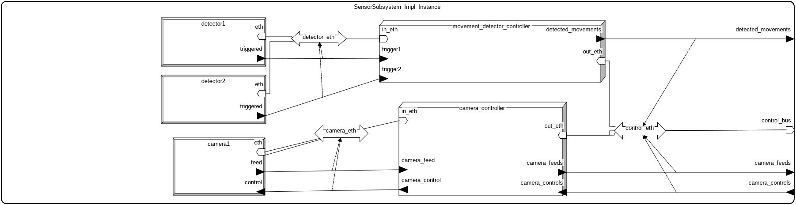

# System Alarmowy
### Michał Tomaszewski mtomaszewski@student.agh.edu.pl

# Opis systemu
System modeluje działanie systemu alarmowego w budynku firmy. Pozwala on na ręczne uzbrajanie i rozbrajanie alarmu, automatyczne uruchamianie procedury alarmowej poprzez rózne urządzenia oraz wykonanie odpowiednich czynności (np. syrena alarmowa, wezwanie ochrony).

# Komponenty systemu alarmowego

## Główne komponenty systemu (wg AADL)

- **ControlSubsystem**
  - Moduł odpowiedzialny za logikę sterowania systemem alarmowym.
  - Odbiera dane o wykrytym ruchu i obrazie z kamer.
  - Steruje kamerą, wyzwala alarm oraz kontroluje drzwi.
  - Interfejsy:
    - `detected_movements` (wejście)
    - `camera_feeds` (wejście)
    - `camera_controls` (wyjście)
    - `trigger_alarm` (wyjście)
    - `door_control` (wyjście)

- **SensorSubsystem**
  - Odpowiada za zbieranie danych z urządzeń detekcyjnych i przekazywanie ich do ControlSubsystem.
  - Składa się z:
    - **detector1**: Czujnik ruchu (MovementDetector)
    - **detector2**: Czujnik ruchu (MovementDetector)
    - **camera1**: Kamera monitoringu (Camera)
    - **movement_detector_controller**: Kontroler czujników ruchu
    - **camera_controller**: Kontroler kamery
    - **Ethernet**: Magistrale komunikacyjne
  - Interfejsy:
    - `detected_movements` (wyjście)
    - `camera_feeds` (wyjście)
    - `camera_controls` (wejście)

- **ActionSubsystem**
  - Moduł wykonawczy realizujący polecenia z ControlSubsystem.
  - Obsługuje wyzwalanie alarmu i sterowanie drzwiami.
  - Interfejsy:
    - `trigger_alarm` (wejście)
    - `door_control` (wejście)

## Urządzenia i magistrale

- **MovementDetector** – urządzenie wykrywające ruch, komunikujące się przez magistralę Ethernet.
- **Camera** – kamera monitoringu, komunikująca się przez magistralę Ethernet.
- **MovementDetectorController** – kontroler obsługujący czujniki ruchu.
- **CameraController** – kontroler obsługujący kamerę.
- **Ethernet** – wspólna magistrala komunikacyjna dla urządzeń i kontrolerów.

## Połączenia między komponentami

- **SensorSubsystem** przekazuje:
  - `detected_movements` do **ControlSubsystem**
  - `camera_feeds` do **ControlSubsystem**

- **ControlSubsystem** przekazuje:
  - `camera_controls` do **SensorSubsystem**
  - `trigger_alarm` do **ActionSubsystem**
  - `door_control` do **ActionSubsystem**

---
# Diagramy
> MainSystem

> SensorSubsystem
